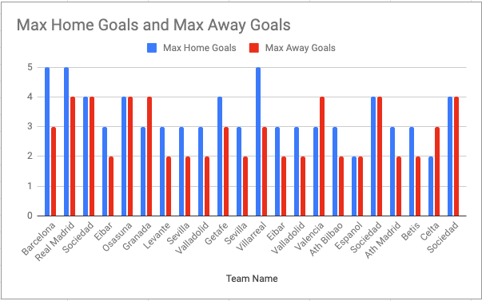

# Spreadsheet Analysis 
Performed analysis using data from the first half of the 2019/2020 Spanish Football Season 

## Contributors 
Workshop was made by Adriana Campanini, Andrew Black and Muhammad Ahmad Saeed 

## Link For the Source Website 
https://sports-statistics.com/sports-data/soccer-datasets/

## Original Data File link and Type 
Format: *CSV* 
Exact link: https://sports-statistics.com/database/soccer-data/spain-la-liga-primera-division-2019-to-2020.csv 

## Snapshot of Data 

| **Div** | **Date**   | **Time** | **HomeTeam** | **AwayTeam** | **FTHG** | **FTAG** | **FTR** | **HTHG** | **HTAG** | **HTR** | **HS** | **AS** | **HST** | **AST** | **HF** | **AF** | **HC** | **AC** | **HY** | **AY** | **HR** | **AR** | **B365H** | **B365D** | **B365A** | **BWH** | **BWD** | **BWA** | **IWH** | **IWD** | **IWA** | **PSH** | **PSD** | **PSA** | **WHH** | **WHD** | **WHA** | **VCH** | **VCD** | **VCA** | **MaxH** | **MaxD** | **MaxA** | **AvgH** | **AvgD** | **AvgA** | **B365>2.5** | **B365<2.5** | **P>2.5** | **P<2.5** | **Max>2.5** | **Max<2.5** | **Avg>2.5** | **Avg<2.5** | **AHh** | **B365AHH** | **B365AHA** | **PAHH** | **PAHA** | **MaxAHH** | **MaxAHA** | **AvgAHH** | **AvgAHA** | **B365CH** | **B365CD** | **B365CA** | **BWCH** | **BWCD** | **BWCA** | **IWCH** | **IWCD** | **IWCA** | **PSCH** | **PSCD** | **PSCA** | **WHCH** | **WHCD** | **WHCA** | **VCCH** | **VCCD** | **VCCA** | **MaxCH** | **MaxCD** | **MaxCA** | **AvgCH** | **AvgCD** | **AvgCA** | **B365C>2.5** | **B365C<2.5** | **PC>2.5** | **PC<2.5** | **MaxC>2.5** | **MaxC<2.5** | **AvgC>2.5** | **AvgC<2.5** | **AHCh** | **B365CAHH** | **B365CAHA** | **PCAHH** | **PCAHA** | **MaxCAHH** | **MaxCAHA** | **AvgCAHH** | **AvgCAHA** |
| ------- | ---------- | -------- | ------------ | ------------ | -------- | -------- | ------- | -------- | -------- | ------- | ------ | ------ | ------- | ------- | ------ | ------ | ------ | ------ | ------ | ------ | ------ | ------ | --------- | --------- | --------- | ------- | ------- | ------- | ------- | ------- | ------- | ------- | ------- | ------- | ------- | ------- | ------- | ------- | ------- | ------- | -------- | -------- | -------- | -------- | -------- | -------- | ------------ | ------------ | --------- | --------- | ----------- | ----------- | ----------- | ----------- | ------- | ----------- | ----------- | -------- | -------- | ---------- | ---------- | ---------- | ---------- | ---------- | ---------- | ---------- | -------- | -------- | -------- | -------- | -------- | -------- | -------- | -------- | -------- | -------- | -------- | -------- | -------- | -------- | -------- | --------- | --------- | --------- | --------- | --------- | --------- | ------------- | ------------- | ---------- | ---------- | ------------ | ------------ | ------------ | ------------ | -------- | ------------ | ------------ | --------- | --------- | ----------- | ----------- | ----------- | ----------- |
| **SP1** | 16/08/2019 | 20:00    | Ath Bilbao   | Barcelona    | 1        | 0        | H       | 0        | 0        | D       | 11     | 11     | 5       | 2       | 14     | 9      | 3      | 8      | 1      | 1      | 0      | 0      | 5.25      | 3.8       | 1.65      | 5.5     | 3.8     | 1.65    | 5       | 3.8     | 1.7     | 5.15    | 3.84    | 1.74    | 5       | 3.8     | 1.7     | 5       | 3.8     | 1.75    | 5.5      | 3.95     | 1.76     | 5.07     | 3.81     | 1.71     | 1.8          | 2            | 1.81      | 2.09      | 1.85        | 2.11        | 1.79        | 2.05        | 0.75    | 1.99        | 1.94        | 1.98     | 1.94     | 2          | 1.95       | 1.96       | 1.92       | 5.25       | 3.8        | 1.65       | 4.75     | 3.75     | 1.75     | 5        | 3.8      | 1.7      | 5.34     | 3.62     | 1.78     | 5        | 3.8      | 1.7      | 4.8      | 3.8      | 1.8      | 5.8       | 3.9       | 1.81      | 5.03      | 3.66      | 1.76      | 1.9           | 1.9           | 1.98       | 1.93       | 1.99         | 2.11         | 1.86         | 1.97         | 0.75     | 1.93         | 2            | 1.91      | 2.01      | 2.02        | 2.03        | 1.91        | 1.98        |
| **SP1** | 17/08/2019 | 16:00    | Celta        | Real Madrid  | 1        | 3        | A       | 0        | 1        | A       | 7      | 17     | 4       | 11      | 17     | 12     | 6      | 4      | 5      | 2      | 0      | 1      | 4.75      | 4.2       | 1.65      | 4.4     | 4.2     | 1.72    | 5.3     | 4.2     | 1.6     | 4.73    | 4.18    | 1.72    | 5.25    | 4.2     | 1.6     | 4.75    | 4.2     | 1.73    | 5.3      | 4.4      | 1.73     | 4.67     | 4.12     | 1.69     | 1.53         | 2.5          | 1.52      | 2.66      | 1.53        | 2.72        | 1.49        | 2.58        | 0.75    | 2.04        | 1.89        | 2.01     | 1.91     | 2.05       | 1.91       | 2          | 1.88       | 5.25       | 4.2        | 1.57       | 4.5      | 4.1      | 1.7      | 4.6      | 3.8      | 1.75     | 5.1      | 4.46     | 1.65     | 5        | 4.2      | 1.63     | 5.2      | 4.4      | 1.65     | 6         | 4.52      | 1.75      | 4.93      | 4.26      | 1.65      | 1.44          | 2.75          | 1.49       | 2.76       | 1.51         | 2.88         | 1.47         | 2.63         | 1        | 1.82         | 1.97         | 1.85      | 2.07      | 2           | 2.2         | 1.82        | 2.06        |
| **SP1** | 17/08/2019 | 18:00    | Valencia     | Sociedad     | 1        | 1        | D       | 0        | 0        | D       | 14     | 12     | 6       | 3       | 13     | 14     | 3      | 3      | 4      | 4      | 1      | 0      | 1.66      | 3.75      | 5.5       | 1.67    | 3.75    | 5.5     | 1.67    | 3.75    | 5.3     | 1.68    | 3.94    | 5.47    | 1.67    | 3.8     | 5.25    | 1.67    | 3.9     | 5.75    | 1.72     | 3.98     | 5.75     | 1.68     | 3.8      | 5.29     | 2            | 1.8          | 2.08      | 1.82      | 2.14        | 1.83        | 2.07        | 1.77        | \-0.75  | 1.91        | 2.02        | 1.91     | 2.01     | 1.93       | 2.03       | 1.89       | 1.99       | 1.66       | 3.75       | 5.5        | 1.65     | 3.8      | 5.5      | 1.67     | 3.8      | 5.3      | 1.69     | 3.88     | 5.47     | 1.65     | 3.9      | 5.25     | 1.7      | 3.9      | 5.5      | 1.72      | 3.95      | 6.2       | 1.68      | 3.82      | 5.37      | 2             | 1.8           | 2.06       | 1.85       | 2.08         | 1.98         | 2            | 1.82         | \-0.75   | 1.94         | 1.99         | 1.92      | 2         | 1.96        | 2.12        | 1.89        | 2           |
| **SP1** | 17/08/2019 | 19:00    | Mallorca     | Eibar        | 2        | 1        | H       | 1        | 0        | H       | 16     | 11     | 4       | 5       | 13     | 14     | 9      | 3      | 2      | 3      | 0      | 0      | 2.8       | 3.2       | 2.6       | 2.95    | 3.1     | 2.6     | 2.9     | 3.1     | 2.6     | 2.98    | 3.14    | 2.66    | 2.9     | 3.1     | 2.62    | 2.9     | 3.13    | 2.7     | 3.05     | 3.2      | 2.7      | 2.91     | 3.09     | 2.62     | 2.3          | 1.61         | 2.45      | 1.6       | 2.47        | 1.65        | 2.34        | 1.6         | 0       | 2.05        | 1.88        | 2.07     | 1.85     | 2.07       | 1.88       | 2.04       | 1.85       | 2.87       | 3.2        | 2.55       | 2.95     | 3.1      | 2.6      | 2.9      | 3.1      | 2.6      | 2.96     | 3.26     | 2.6      | 2.9      | 3.1      | 2.6      | 3        | 3.13     | 2.63     | 3.05      | 3.29      | 2.72      | 2.93      | 3.14      | 2.59      | 2.2           | 1.66          | 2.2        | 1.74       | 2.38         | 1.74         | 2.24         | 1.66         | 0        | 2.11         | 1.82         | 2.09      | 1.83      | 2.12        | 1.88        | 2.07        | 1.83        |
| **SP1** | 17/08/2019 | 20:00    | Leganes      | Osasuna      | 0        | 1        | A       | 0        | 0        | D       | 13     | 4      | 2       | 2       | 17     | 11     | 8      | 0      | 1      | 4      | 1      | 0      | 2         | 3.2       | 4.2       | 2.05    | 3.25    | 3.9     | 2.05    | 3.1     | 4.05    | 2.1     | 3.21    | 4.13    | 2.05    | 3.2     | 4       | 2.1     | 3.2     | 4.1     | 2.1      | 3.3      | 4.25     | 2.06     | 3.18     | 4.02     | 2.5          | 1.53         | 2.72      | 1.5       | 2.75        | 1.54        | 2.59        | 1.49        | \-0.5   | 2.08        | 1.85        | 2.1      | 1.82     | 2.1        | 1.85       | 2.06       | 1.83       | 1.9        | 3.1        | 5          | 1.95     | 3.2      | 4.5      | 1.9      | 3.15     | 4.85     | 1.9      | 3.18     | 5.3      | 2.05     | 3.2      | 4        | 1.9      | 3.2      | 5.2      | 1.95      | 3.26      | 5.3       | 1.9       | 3.16      | 4.91      | 2.75          | 1.44          | 2.84       | 1.47       | 2.85         | 1.5          | 2.69         | 1.46         | \-0.5    | 1.89         | 2.04         | 1.9       | 2.01      | 1.95        | 2.06        | 1.9         | 1.99        |
| **SP1** | 17/08/2019 | 20:00    | Villarreal   | Granada      | 4        | 4        | D       | 1        | 1        | D       | 12     | 14     | 7       | 7       | 10     | 16     | 2      | 7      | 3      | 1      | 0      | 0      | 1.6       | 3.8       | 6.5       | 1.6     | 3.8     | 6.25    | 1.63    | 4       | 5.5     | 1.62    | 3.99    | 6.13    | 1.6     | 3.9     | 5.8     | 1.65    | 4       | 5.75    | 1.65     | 4.15     | 6.5      | 1.61     | 3.95     | 5.8      | 1.8          | 2            | 1.88      | 2.02      | 1.9         | 2.05        | 1.84        | 1.98        | \-1     | 2.05        | 1.75        | 2.11     | 1.81     | 2.14       | 1.85       | 2.07       | 1.8        | 1.53       | 4          | 6.5        | 1.57     | 3.8      | 6.5      | 1.55     | 4.05     | 6.3      | 1.54     | 4.19     | 6.87     | 1.62     | 3.9      | 5.8      | 1.57     | 4        | 7        | 1.58      | 4.2       | 7.3       | 1.54      | 4.05      | 6.66      | 1.9           | 1.9           | 1.95       | 1.95       | 1.98         | 2.1          | 1.9          | 1.92         | \-1      | 1.96         | 1.97         | 1.96      | 1.96      | 1.98        | 2.12        | 1.93        | 1.95        |
| **SP1** | 18/08/2019 | 16:00    | Alaves       | Levante      | 1        | 0        | H       | 0        | 0        | D       | 9      | 16     | 2       | 4       | 18     | 15     | 2      | 9      | 2      | 1      | 0      | 0      | 2.15      | 3.2       | 3.6       | 2.15    | 3.3     | 3.6     | 2.2     | 3.25    | 3.4     | 2.29    | 3.31    | 3.45    | 2.25    | 3.3     | 3.3     | 2.25    | 3.3     | 3.3     | 2.31     | 3.4      | 3.6      | 2.23     | 3.25     | 3.43     | 2.1          | 1.72         | 2.16      | 1.76      | 2.2         | 1.77        | 2.13        | 1.72        | \-0.25  | 1.95        | 1.98        | 1.96     | 1.96     | 1.97       | 1.99       | 1.93       | 1.95       | 2.3        | 3.4        | 3.2        | 2.35     | 3.2      | 3.2      | 2.35     | 3.25     | 3.15     | 2.43     | 3.27     | 3.2      | 2.25     | 3.3      | 3.3      | 2.45     | 3.3      | 3.13     | 2.46      | 3.42      | 3.58      | 2.37      | 3.25      | 3.18      | 2.1           | 1.72          | 2.18       | 1.75       | 2.18         | 1.83         | 2.1          | 1.74         | \-0.25   | 2.08         | 1.85         | 2.08      | 1.84      | 2.09        | 1.97        | 2.04        | 1.85        |
| **SP1** | 18/08/2019 | 18:00    | Espanol      | Sevilla      | 0        | 2        | A       | 0        | 1        | A       | 7      | 12     | 2       | 4       | 11     | 17     | 8      | 4      | 2      | 2      | 0      | 0      | 3.2       | 3.3       | 2.3       | 3.1     | 3.4     | 2.3     | 3.1     | 3.4     | 2.3     | 3.13    | 3.56    | 2.33    | 3       | 3.5     | 2.3     | 3       | 3.5     | 2.3     | 3.2      | 3.56     | 2.4      | 3.08     | 3.41     | 2.33     | 1.9          | 1.9          | 1.95      | 1.95      | 1.98        | 1.95        | 1.92        | 1.89        | 0.25    | 1.88        | 2.05        | 1.9      | 2.02     | 1.9        | 2.06       | 1.87       | 2.01       | 3          | 3.4        | 2.4        | 3        | 3.4      | 2.35     | 3        | 3.35     | 2.35     | 3.13     | 3.38     | 2.41     | 3        | 3.4      | 2.35     | 3.13     | 3.4      | 2.4      | 3.38      | 3.47      | 2.48      | 3.05      | 3.34      | 2.39      | 2             | 1.8           | 2.04       | 1.85       | 2.09         | 2.05         | 1.97         | 1.85         | 0.25     | 1.86         | 2.07         | 1.85      | 2.07      | 1.98        | 2.11        | 1.84        | 2.05        |
| **SP1** | 18/08/2019 | 20:00    | Betis        | Valladolid   | 1        | 2        | A       | 0        | 0        | D       | 13     | 14     | 4       | 3       | 11     | 19     | 6      | 1      | 2      | 6      | 1      | 0      | 1.66      | 3.75      | 5.5       | 1.65    | 3.75    | 5.75    | 1.63    | 3.75    | 5.7     | 1.63    | 3.81    | 6.38    | 1.62    | 3.75    | 6       | 1.62    | 3.8     | 5.75    | 1.67     | 3.9      | 6.5      | 1.64     | 3.76     | 5.78     | 2.1          | 1.72         | 2.16      | 1.76      | 2.21        | 1.78        | 2.13        | 1.72        | \-0.75  | 1.86        | 2.07        | 1.84     | 2.08     | 1.87       | 2.08       | 1.83       | 2.06       | 1.8        | 3.6        | 4.75       | 1.8      | 3.4      | 5        | 1.85     | 3.55     | 4.4      | 1.82     | 3.53     | 5.07     | 1.78     | 3.5      | 5        | 1.87     | 3.5      | 4.6      | 1.87      | 3.65      | 5.35      | 1.83      | 3.5       | 4.74      | 2             | 1.8           | 2.03       | 1.87       | 2.07         | 1.92         | 1.99         | 1.83         | \-0.75   | 2.02         | 1.77         | 2.08      | 1.84      | 2.14        | 1.92        | 2.08        | 1.81        |
| **SP1** | 18/08/2019 | 21:00    | Ath Madrid   | Getafe       | 1        | 0        | H       | 1        | 0        | H       | 5      | 6      | 5       | 0       | 19     | 22     | 3      | 4      | 3      | 4      | 1      | 1      | 1.44      | 4.33      | 8         | 1.45    | 4.33    | 7.5     | 1.45    | 4.4     | 7.2     | 1.49    | 4.34    | 7.58    | 1.47    | 4.2     | 8       | 1.45    | 4.2     | 8       | 1.52     | 4.5      | 8.5      | 1.47     | 4.23     | 7.63     | 2.2          | 1.66         | 2.3       | 1.68      | 2.3         | 1.71        | 2.23        | 1.66        | \-1     | 1.88        | 2.05        | 1.88     | 2.04     | 1.89       | 2.08       | 1.85       | 2.03       | 1.5        | 4          | 8          | 1.5      | 3.9      | 7.75     | 1.5      | 3.9      | 7.6      | 1.57     | 3.78     | 7.66     | 1.5      | 3.8      | 8        | 1.55     | 3.9      | 8        | 1.58      | 4.05      | 8.9       | 1.53      | 3.84      | 7.68      | 2.37          | 1.57          | 2.43       | 1.61       | 2.46         | 1.65         | 2.36         | 1.59         | \-1      | 2.06         | 1.87         | 2.07      | 1.85      | 2.07        | 2.1         | 1.97        | 1.91        |
| **SP1** | 23/08/2019 | 19:00    | Granada      | Sevilla      | 0        | 1        | A       | 0        | 0        | D       | 12     | 11     | 0       | 6       | 13     | 14     | 6      | 6      | 1      | 1      | 0      | 0      | 3.6       | 3.6       | 1.95      | 3.9     | 3.4     | 1.91    | 3.95    | 3.6     | 1.9     | 4.07    | 3.68    | 1.96    | 4       | 3.6     | 1.91    | 4.1     | 3.6     | 1.95    | 4.33     | 3.75     | 2        | 3.95     | 3.58     | 1.94     | 1.9          | 1.9          | 1.94      | 1.96      | 1.94        | 1.99        | 1.89        | 1.93        | 0.5     | 1.96        | 1.94        | 1.96     | 1.96     | 1.98       | 1.97       | 1.94       | 1.94       | 3.8        | 3.6        | 1.95       | 4        | 3.5      | 1.95     | 3.6      | 3.6      | 2        | 4.03     | 3.57     | 2        | 4        | 3.6      | 1.91     | 4        | 3.6      | 2        | 4.1       | 3.68      | 2.04      | 3.91      | 3.52      | 1.98      | 2             | 1.8           | 2.03       | 1.87       | 2.13         | 1.89         | 1.98         | 1.84         | 0.5      | 1.91         | 2.02         | 1.92      | 2         | 1.95        | 2.04        | 1.9         | 1.99        |
| **SP1** | 23/08/2019 | 21:00    | Levante      | Villarreal   | 2        | 1        | H       | 0        | 1        | A       | 16     | 23     | 4       | 6       | 5      | 9      | 7      | 3      | 1      | 2      | 0      | 0      | 2.55      | 3.4       | 2.62      | 2.55    | 3.4     | 2.6     | 2.6     | 3.55    | 2.6     | 2.64    | 3.67    | 2.64    | 2.55    | 3.6     | 2.6     | 2.63    | 3.6     | 2.7     | 2.67     | 3.74     | 2.7      | 2.59     | 3.54     | 2.63     | 1.72         | 2.1          | 1.71      | 2.23      | 1.74        | 2.25        | 1.7         | 2.17        | 0       | 1.94        | 1.96        | 1.96     | 1.96     | 1.97       | 1.99       | 1.94       | 1.95       | 2.5        | 3.6        | 2.7        | 2.5      | 3.6      | 2.7      | 2.5      | 3.6      | 2.65     | 2.57     | 3.61     | 2.75     | 2.6      | 3.5      | 2.62     | 2.6      | 3.6      | 2.7      | 2.67      | 3.7       | 2.82      | 2.54      | 3.58      | 2.69      | 1.61          | 2.3           | 1.64       | 2.38       | 1.67         | 2.4          | 1.62         | 2.32         | 0        | 1.91         | 2.02         | 1.89      | 2.02      | 1.92        | 2.04        | 1.89        | 2           |
| **SP1** | 24/08/2019 | 16:00    | Osasuna      | Eibar        | 0        | 0        | D       | 0        | 0        | D       | 6      | 12     | 2       | 0       | 15     | 12     | 6      | 6      | 4      | 4      | 0      | 0      | 2.5       | 3.2       | 2.9       | 2.5     | 3.1     | 2.9     | 2.55    | 3.15    | 2.9     | 2.56    | 3.13    | 3.13    | 2.45    | 3.2     | 3       | 2.6     | 3.2     | 3       | 2.6      | 3.3      | 3.13     | 2.53     | 3.12     | 2.99     | 2.3          | 1.61         | 2.41      | 1.62      | 2.41        | 1.7         | 2.29        | 1.63        | \-0.25  | 2.07        | 1.72        | 2.16     | 1.78     | 2.2        | 1.8        | 2.13       | 1.76       | 2.7        | 3.2        | 2.7        | 2.75     | 3.1      | 2.75     | 2.85     | 3.1      | 2.65     | 2.89     | 3.16     | 2.72     | 2.55     | 3.1      | 3        | 2.9      | 3.13     | 2.7      | 2.92      | 3.26      | 3.05      | 2.77      | 3.11      | 2.74      | 2.3           | 1.61          | 2.39       | 1.63       | 2.42         | 1.67         | 2.31         | 1.62         | 0        | 2.03         | 1.9          | 2.02      | 1.9       | 2.06        | 2.14        | 1.98        | 1.91        |
| **SP1** | 24/08/2019 | 18:00    | Real Madrid  | Valladolid   | 1        | 1        | D       | 0        | 0        | D       | 22     | 9      | 4       | 2       | 12     | 11     | 4      | 3      | 2      | 2      | 0      | 0      | 1.2       | 6.5       | 13        | 1.2     | 6.75    | 11.5    | 1.2     | 6.8     | 13.5    | 1.2     | 7.6     | 13.9    | 1.2     | 7       | 13      | 1.22    | 7       | 15      | 1.23     | 7.6      | 15       | 1.21     | 6.97     | 13.16    | 1.36         | 3.2          | 1.37      | 3.29      | 1.39        | 3.3         | 1.36        | 3.1         | \-2     | 1.96        | 1.94        | 1.99     | 1.93     | 1.99       | 1.96       | 1.95       | 1.92       | 1.2        | 7          | 12         | 1.2      | 7.25     | 13       | 1.2      | 6.8      | 13.5     | 1.23     | 7.32     | 13.12    | 1.2      | 7        | 13       | 1.22     | 7        | 13       | 1.24      | 7.5       | 14.5      | 1.21      | 7.11      | 12.57     | 1.4           | 3             | 1.4        | 3.1        | 1.41         | 3.26         | 1.38         | 3.02         | \-2      | 2.05         | 1.75         | 2.17      | 1.77      | 2.17        | 1.96        | 2.05        | 1.82        |
| **SP1** | 24/08/2019 | 20:00    | Celta        | Valencia     | 1        | 0        | H       | 1        | 0        | H       | 11     | 9      | 6       | 1       | 8      | 12     | 6      | 4      | 1      | 2      | 0      | 0      | 3.1       | 3.4       | 2.25      | 3.1     | 3.3     | 2.25    | 3.2     | 3.4     | 2.25    | 3.22    | 3.58    | 2.28    | 3.1     | 3.5     | 2.25    | 3.25    | 3.5     | 2.3     | 3.27     | 3.6      | 2.31     | 3.17     | 3.45     | 2.26     | 1.9          | 1.9          | 1.92      | 1.98      | 1.94        | 1.98        | 1.89        | 1.92        | 0.25    | 1.93        | 1.97        | 1.94     | 1.98     | 1.95       | 1.99       | 1.92       | 1.95       | 3.2        | 3.4        | 2.2        | 3.2      | 3.4      | 2.25     | 3.3      | 3.45     | 2.15     | 3.15     | 3.43     | 2.38     | 3.3      | 3.4      | 2.2      | 3.3      | 3.4      | 2.3      | 3.58      | 3.6       | 2.38      | 3.25      | 3.41      | 2.25      | 1.9           | 1.9           | 1.95       | 1.95       | 2.01         | 2.08         | 1.9          | 1.91         | 0.25     | 1.92         | 2.01         | 1.87      | 2.05      | 2.07        | 2.05        | 1.92        | 1.97        |
| **SP1** | 24/08/2019 | 20:00    | Getafe       | Ath Bilbao   | 1        | 1        | D       | 1        | 1        | D       | 6      | 4      | 2       | 2       | 15     | 11     | 4      | 6      | 2      | 1      | 0      | 0      | 2.6       | 3         | 2.9       | 2.6     | 2.9     | 2.9     | 2.65    | 2.9     | 3.05    | 2.65    | 2.96    | 3.19    | 2.55    | 3       | 3.1     | 2.63    | 3       | 3.13    | 2.7      | 3.06     | 3.19     | 2.61     | 2.94     | 3.06     | 3            | 1.4          | 2.97      | 1.43      | 3           | 1.47        | 2.84        | 1.42        | 0       | 1.79        | 2.11        | 1.78     | 2.15     | 1.83       | 2.15       | 1.79       | 2.11       | 2.5        | 2.9        | 3.3        | 2.5      | 2.9      | 3.3      | 2.45     | 2.85     | 3.4      | 2.54     | 2.82     | 3.55     | 2.45     | 2.88     | 3.4      | 2.55     | 2.9      | 3.4      | 2.61      | 2.95      | 3.6       | 2.51      | 2.85      | 3.36      | 3.2           | 1.36          | 3.22       | 1.38       | 3.23         | 1.45         | 2.99         | 1.39         | \-0.25   | 2.13         | 1.81         | 2.11      | 1.81      | 2.2         | 1.84        | 2.11        | 1.79        |
| **SP1** | 25/08/2019 | 16:00    | Alaves       | Espanol      | 0        | 0        | D       | 0        | 0        | D       | 10     | 5      | 2       | 1       | 13     | 10     | 3      | 5      | 3      | 1      | 0      | 0      | 2.45      | 3.2       | 3         | 2.45    | 3.2     | 2.9     | 2.55    | 3.05    | 3       | 2.53    | 3.3     | 3.02    | 2.5     | 3.2     | 3       | 2.55    | 3.13    | 3       | 2.6      | 3.32     | 3.1      | 2.52     | 3.18     | 2.97     | 2.5          | 1.53         | 2.55      | 1.56      | 2.56        | 1.6         | 2.47        | 1.55        | 0       | 1.79        | 2.11        | 1.79     | 2.14     | 1.83       | 2.14       | 1.8        | 2.1        | 2.6        | 3.1        | 2.87       | 2.7      | 3        | 2.85     | 2.75     | 2.95     | 2.85     | 2.69     | 3.02     | 3.06     | 2.62     | 3.1      | 2.88     | 2.75     | 3.1      | 2.9      | 2.8       | 3.17      | 3.06      | 2.71      | 3         | 2.9       | 2.75          | 1.44          | 2.95       | 1.44       | 2.95         | 1.51         | 2.69         | 1.47         | 0        | 1.87         | 2.06         | 1.83      | 2.09      | 1.91        | 2.09        | 1.87        | 2.02        |
| **SP1** | 25/08/2019 | 16:00    | Mallorca     | Sociedad     | 0        | 1        | A       | 0        | 0        | D       | 12     | 12     | 4       | 4       | 16     | 12     | 5      | 5      | 1      | 2      | 0      | 0      | 3.1       | 3.1       | 2.4       | 3.1     | 3.1     | 2.35    | 3       | 3.25    | 2.45    | 3.12    | 3.29    | 2.47    | 3       | 3.3     | 2.4     | 2.9     | 3.3     | 2.5     | 3.12     | 3.42     | 2.52     | 3.02     | 3.23     | 2.44     | 2            | 1.8          | 2.17      | 1.76      | 2.17        | 1.81        | 2.08        | 1.75        | 0.25    | 1.78        | 2.13        | 1.81     | 2.11     | 1.82       | 2.16       | 1.79       | 2.1        | 3.1        | 3.25       | 2.37       | 3.1      | 3.2      | 2.4      | 3.05     | 3.25     | 2.4      | 3.14     | 3.26     | 2.48     | 3.1      | 3.2      | 2.4      | 3.1      | 3.3      | 2.45     | 3.22      | 3.32      | 2.5       | 3.11      | 3.22      | 2.41      | 2.2           | 1.66          | 2.23       | 1.72       | 2.35         | 1.77         | 2.15         | 1.71         | 0.25     | 1.81         | 2.13         | 1.81      | 2.11      | 1.84        | 2.14        | 1.81        | 2.08        |
| **SP1** | 25/08/2019 | 18:00    | Leganes      | Ath Madrid   | 0        | 1        | A       | 0        | 0        | D       | 10     | 6      | 4       | 4       | 12     | 13     | 9      | 4      | 4      | 5      | 0      | 0      | 4.75      | 3.4       | 1.8       | 4.75    | 3.3     | 1.8     | 5.2     | 3.3     | 1.8     | 5.62    | 3.31    | 1.81    | 5.5     | 3.2     | 1.8     | 5.25    | 3.3     | 1.8     | 5.65     | 3.4      | 1.87     | 5.18     | 3.29     | 1.81     | 2.5          | 1.53         | 2.67      | 1.52      | 2.67        | 1.56        | 2.54        | 1.52        | 0.5     | 2.08        | 1.82        | 2.11     | 1.81     | 2.13       | 1.84       | 2.08       | 1.8        | 4.75       | 3.1        | 1.95       | 5        | 3.1      | 1.9      | 5        | 3.1      | 1.9      | 5.05     | 2.99     | 2.02     | 5.25     | 3        | 1.91     | 4.8      | 3.1      | 2        | 5.9       | 3.3       | 2.05      | 5.01      | 3.02      | 1.95      | 3.4           | 1.33          | 3.3        | 1.37       | 3.4          | 1.46         | 3.08         | 1.37         | 0.5      | 1.91         | 2.02         | 1.9       | 2.02      | 2.11        | 2.04        | 1.92        | 1.97        |
| **SP1** | 25/08/2019 | 20:00    | Barcelona    | Betis        | 5        | 2        | H       | 1        | 1        | D       | 20     | 4      | 7       | 3       | 14     | 12     | 11     | 0      | 1      | 1      | 0      | 0      | 1.25      | 6         | 10        | 1.25    | 6       | 10      | 1.25    | 6.1     | 11      | 1.27    | 6.21    | 11.33   | 1.25    | 6       | 11      | 1.25    | 6       | 11.5    | 1.29     | 6.55     | 11.75    | 1.27     | 6.07     | 10.56    | 1.4          | 3            | 1.41      | 3.07      | 1.43        | 3.1         | 1.39        | 2.95        | \-1.75  | 1.95        | 1.95        | 1.96     | 1.96     | 1.97       | 1.97       | 1.93       | 1.94       | 1.36       | 5          | 7.5        | 1.36     | 5        | 8.5      | 1.35     | 5.3      | 8        | 1.37     | 5.17     | 8.99     | 1.36     | 5        | 8.5      | 1.4      | 5.2      | 8        | 1.4       | 5.3       | 9         | 1.37      | 5.03      | 8.34      | 1.61          | 2.3           | 1.64       | 2.37       | 1.65         | 2.43         | 1.58         | 2.33         | \-1.25   | 1.89         | 2.04         | 1.86      | 2.06      | 1.9         | 2.1         | 1.85        | 2.04        |

## Problems with Data and Scrubbing Tasks 
- We placed the csv file in the folder labelled data in order to access it from within our plain text editor. 
- Once we had it there, we needed to take only a few columns from the data. 
- It was also up to us to understand what the column headings were since our source website provided little context. 
- We used munge.py to get the columns we wanted 
- def scrub

    input_file = csv.DictReader(open ('data/spain-la-liga-primera-division-2019-to-2020.csv'))

    headings = ['HomeTeam', 'AwayTeam', 'FTHG', 'FTAG', 'FTR', 'HTHG', 'HTAG', 'HTR', 'HS', 'AS', 'B365CH', 'B365CA']

    headings_joined = (',').join(headings)

- We had to save the data we needed into a new csv file which we named clean_data. The recarods that we wanted to exist in our new csv file were filtered out as shown below 

    x = ','.join(write_line)

    #remove columns 4-5

    outfile.write(x)

    outfile.write('\n)
    
- Once we had this new file, we imported it into google sheets and performed our various analysis on the data. 

# Analysis 

## Goal Conversion Rate 
- We calculated the percentage of shots converted into goals by the home team versus the away team to understand whether teams were more clinical with their shots at home or at Away matches 
- This was done by dividing the column of away/home goals “FTAG” and “FTHG” by home shots and away shots ‘HS’ and ‘AS’ and then utilizing the average function to get a mean of the conversion rates for home and away teams 

## Winning at Half-Time statistic 
- This was calculated by taking the score at half time and determining the winner. It required the countIF built in function in google sheets using the following formula =COUNTIF(E:E, "A")/COUNTA(E:E)*100.  
- We did this for both the away side and the home side and found conditioned aggregate statistics 

## Percentage Home Team being the betting favorites 
- We first made a new column which simply told us whether the home team was a favorite to win the match by statistics based off of Bet365 and we aggregated the results based on the consition of whether the away or home team were the favorites and came up with a percentage that displays the net chances of the Home Team being betting favorites and the away team being better favorites. 
- We used this formule to compute the aggregate number : =countif(M2:M180, TRUE)/counta(M:M)*100

## Amount of goals away/home and total

- The idea for the first pivot table was to calculate the total amount of goals each team did during their 2019-2020 season. The first thing done was the total amount of goals each team did away and then a calculation of how many goals each team did home. The total then was achieved by adding both goals away and home. After this was done the most goals of the season was calculated and in this season it was Barcelona FC and the least number of goals that season was done by the Espanol team (reason for why this team is now playing for the second league this year because of coming last, as their lack of goals). For all of this; sumif() / max() / min() was used.

| Team        | Home | Away | Total |
| ----------- | ---- | ---- | ----- |
| Ath Bilbao  | 13   | 3    | 16    |
| Celta       | 6    | 10   | 16    |
| Valencia    | 15   | 9    | 24    |
| Mallorca    | 11   | 11   | 22    |
| Leganes     | 10   | 14   | 24    |
| Villarreal  | 19   | 11   | 30    |
| Alaves      | 11   | 5    | 16    |
| Espanol     | 7    | 20   | 27    |
| Betis       | 17   | 14   | 31    |
| Ath Madrid  | 12   | 5    | 17    |
| Granada     | 11   | 6    | 17    |
| Levante     | 15   | 10   | 25    |
| Osasuna     | 16   | 13   | 29    |
| Real Madrid | 20   | 6    | 26    |
| Getafe      | 17   | 7    | 24    |
| Barcelona   | 34   | 10   | 44    |
| Sevilla     | 10   | 7    | 17    |
| Sociedad    | 17   | 9    | 26    |
| Eibar       | 11   | 15   | 26    |
| Valladolid  | 8    | 4    | 12    |

## Amount of goals conceded by each team

This calculation was done by adding the number of goals of each opposite team in each match. The conceded goals show how many goals the opposite team scored. 

## Calculating the maximum goals scored on Home and Away 

- This calculation was carried out using the maxifs function of google sheet which allowed us to get the maximum number of goals each team has scored on home ground and on away ground respectively. 
- I used this table to calculate the statistics using a formula like this: =MAXIFS(C2:C181,A2:A181,Q161)
- The table looks like this: 

| Team Name   | Max Home Goals | Max Away Goals |
| ----------- | -------------- | -------------- |
| Barcelona   | 5              | 3              |
| Real Madrid | 5              | 4              |
| Sociedad    | 4              | 4              |
| Eibar       | 3              | 2              |
| Osasuna     | 4              | 4              |
| Granada     | 3              | 4              |
| Levante     | 3              | 2              |
| Sevilla     | 3              | 2              |
| Valladolid  | 3              | 2              |
| Getafe      | 4              | 3              |
| Sevilla     | 3              | 2              |
| Villarreal  | 5              | 3              |
| Eibar       | 3              | 2              |
| Valladolid  | 3              | 2              |
| Valencia    | 3              | 4              |
| Ath Bilbao  | 3              | 2              |
| Espanol     | 2              | 2              |
| Sociedad    | 4              | 4              |
| Ath Madrid  | 3              | 2              |
| Betis       | 3              | 2              |
| Celta       | 2              | 3              |
| Sociedad    | 4              | 4              |

- The chart was made from this table which demonstrates how often each team scored at Away and Home. The best team would score more in both types of matches. The chart looked as the following: 

